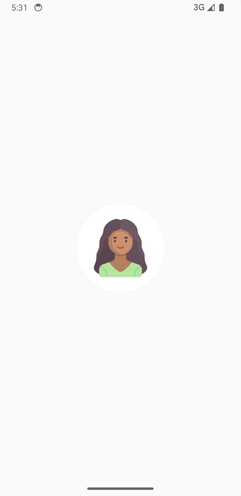
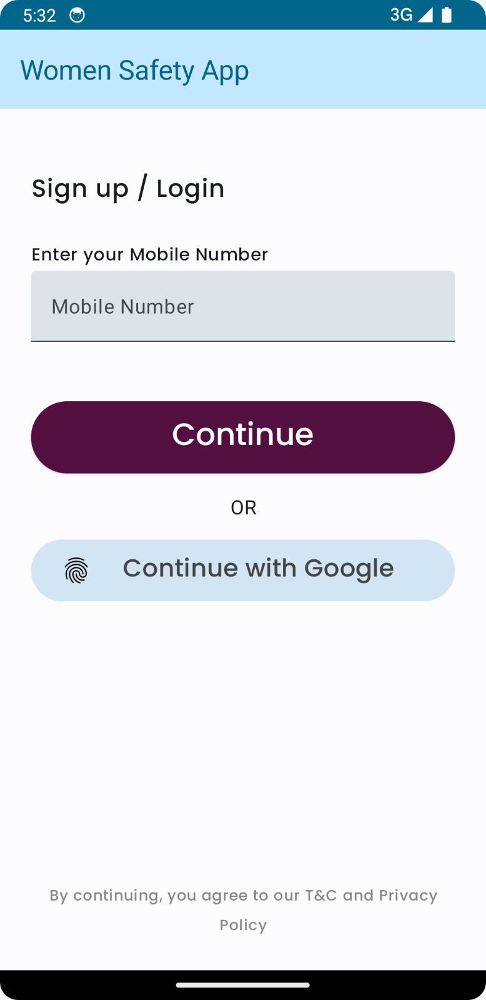
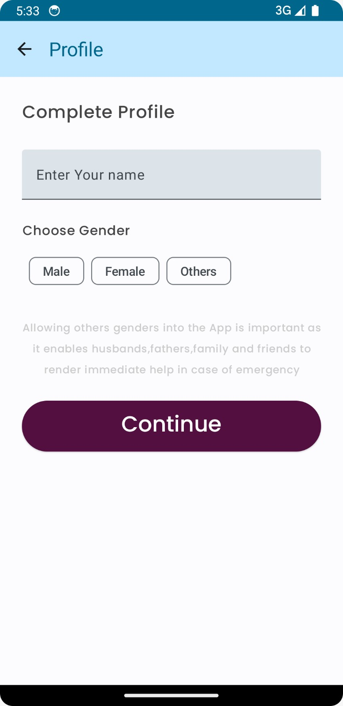
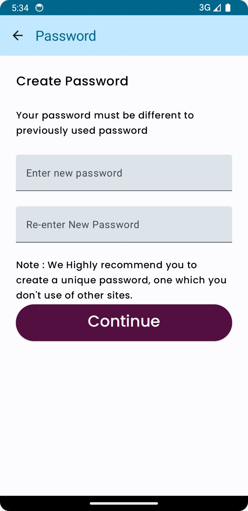
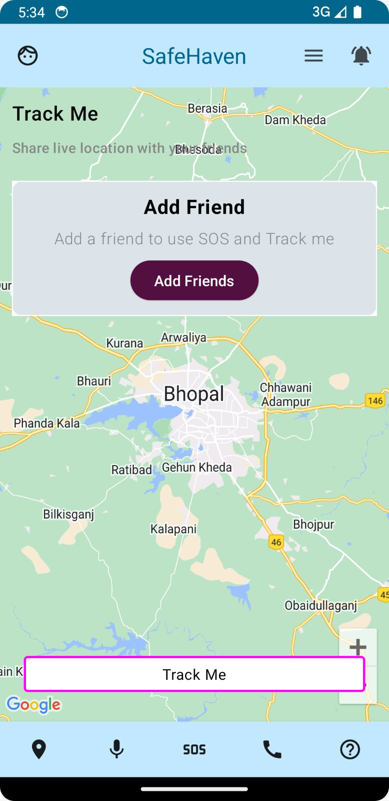
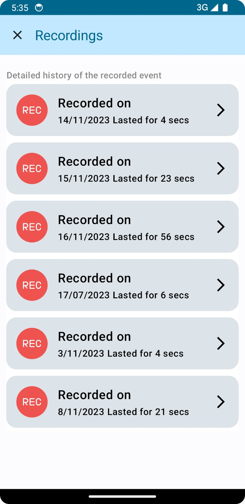
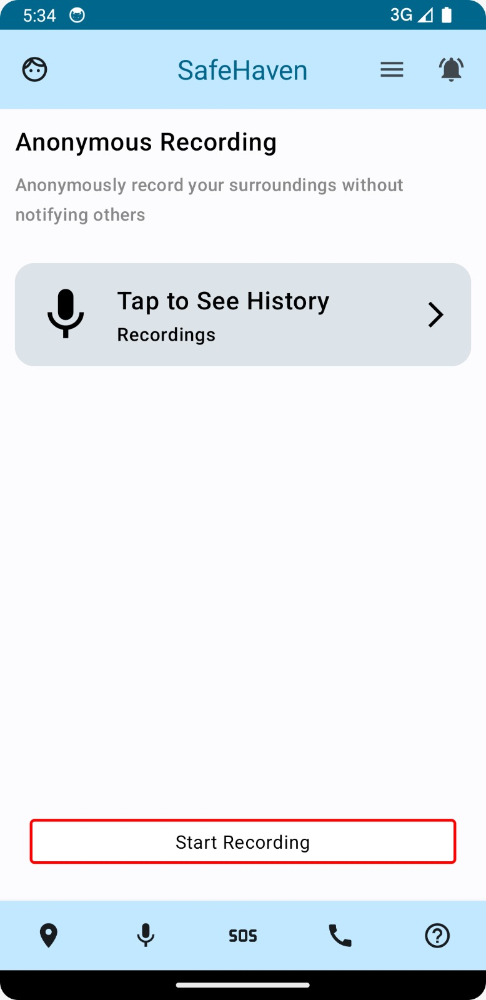
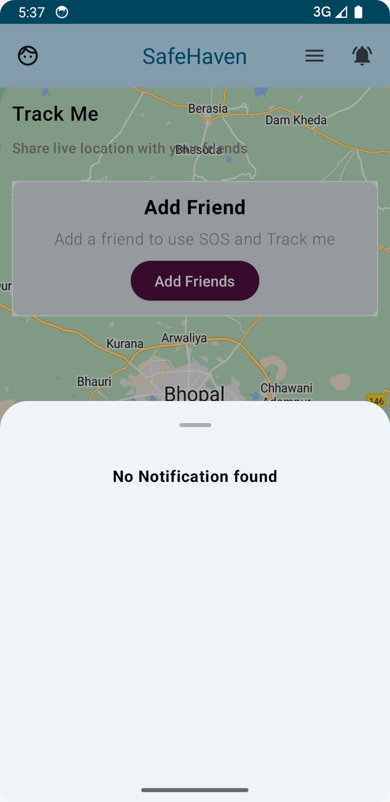
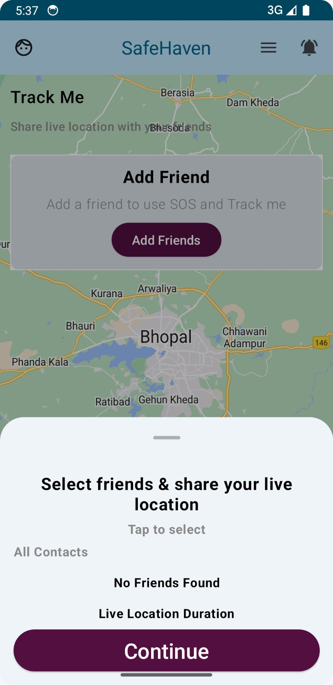
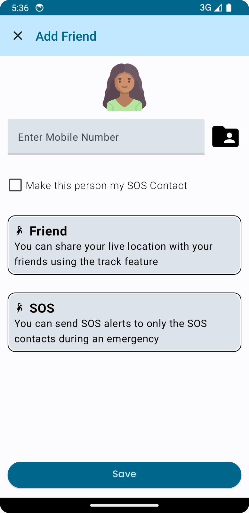

# ComposeWomen
Native Android UI Toolkit. Jetpack Compose.

#### App Composable Screenshots.

<table>
    <tr>
    <td>Splash</td>
    <td>Login</td>
    </tr>
    <tr>
    <td></td>
    <td></td>
    </tr>
</table>

<table>
    <tr>
    <td>OTP</td>
    <td>Create Profile</td>
    </tr>
    <tr>
    <td></td>
    <td></td>
    </tr>
</table>

<table>
    <tr>
    <td>Password</td>
    <td>Dashboard Map</td>
    </tr>
    <tr>
    <td></td>
    <td></td>
    </tr>
</table>

<table>
    <tr>
    <td>Record List</td>
    <td>Dashboard Record</td>
    </tr>
    <tr>
    <td></td>
    <td></td>
    </tr>
</table>

<table>
    <tr>
    <td>Notification Sheet</td>
    <td>Add Friend Sheet</td>
    </tr>
    <tr>
    <td></td>
    <td></td>
    </tr>
</table>

<table>
    <tr>
    <td>Add Friend</td>
    <td>Splash</td>
    </tr>
    <tr>
    <td></td>
    <td></td>
    </tr>
</table>

